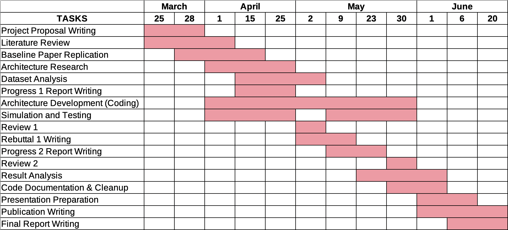

# AI604-Project

## General Idea

We aim to leverage the Transformer architecture to address domain adaptation problem due to CNN's inherent inductive bias. The Transformer architecture has been shown to work in various domains of data formats, including NLP, time series, and most recently, images. 

[An Image is Worth 16x16 Words: Transformers for Image Recognition at Scale](https://arxiv.org/abs/2010.11929)

### Repositories
[google-research](https://github.com/google-research/vision_transformer)
[lucidrains](https://github.com/lucidrains/vit-pytorch)
[jeonsworld](https://github.com/jeonsworld/ViT-pytorch)

```
@misc{dosovitskiy2020image,
      title={An Image is Worth 16x16 Words: Transformers for Image Recognition at Scale}, 
      author={Alexey Dosovitskiy and Lucas Beyer and Alexander Kolesnikov and Dirk Weissenborn and Xiaohua Zhai and Thomas Unterthiner and Mostafa Dehghani and Matthias Minderer and Georg Heigold and Sylvain Gelly and Jakob Uszkoreit and Neil Houlsby},
      year={2020},
      eprint={2010.11929},
      archivePrefix={arXiv},
      primaryClass={cs.CV}
}
```

We plan to leverage large pre-trained Transformer Encoder to apply to various image domains, possibly combined with CNNs. 

## Some papers

### Medical Image Segmentation 

* [U-Net: Convolution Networks for Biomedical Image Segmentation](https://arxiv.org/abs/1505.04597) [(Repository)](https://github.com/zhixuhao/unet)
* [TransUNet: Transformers Make Strong Encoders for Medical Image Segmentation](https://arxiv.org/abs/2102.04306) [(Repository)](https://github.com/Beckschen/TransUNet)
* [Structured crowdsourcing enables convolutional segmentation of histology images](https://watermark.silverchair.com/btz083.pdf?token=AQECAHi208BE49Ooan9kkhW_Ercy7Dm3ZL_9Cf3qfKAc485ysgAAAsIwggK-BgkqhkiG9w0BBwagggKvMIICqwIBADCCAqQGCSqGSIb3DQEHATAeBglghkgBZQMEAS4wEQQMDjIKI5x3PxbDWWThAgEQgIICddmHkjN7ANxZTwaVoZuynLAwvk5q0O2apfsP_I2K0zUDN9axfC57dBuaDws7ZVUqoR14BjtiC6yiHNjX85-j9v-oWl3ufWshSBNgpyX9aM5jdxoVxR0ujI9JBf3ENVhMCvqVcSBlXBUoHA67B72RUCGQp8PR6z47L_Bua0RevKCe_dvwVqrR3F4kYOhIQJpDFOdHZPl3sNSTt4RXVNKzWvl34c4v2R4B_iNne5NC8Cqr0lfSzad0g3pwJlaxj3JE62wfXUDcigJZAzpEJE0O1O3HseX64cc43vq7MotOGxZejav4NyFqhsUnZPnHqo28-BVneNsiMWgBKHV_6dTNzGteU0ML8-M39AgcJE7ENgfBWV5fkI25EsNpCkRisHqMcoQIBQ_R7v5_RObZvnXGhCHSPF8UvHIkXy_MrMuT0dbCLxABJjjANDravat-r0DeO4IqB_i2C0H16CNZ8eYmr1qb0JuR4wh7ZbJrs6gvS6Aw6Hx5poKeR_ODad3R0-gn33H9LMDVOM4iM6dFN7vYH6jOwJqQ_U1_g1mvjOYIn6NjY7BqZrhuYEGXSVqTkeYg-a4mzNQR5hlSVAnnCoLPRblc9f9S-JQkoCZ5yxTMlatoIwchgjs8ZO_Ashs8Y_hD8QLAW0tRcysVlXS1KfZmyghmWWG3eaxx-slGmYYfKd_OBODSVdhh4qUXTiTs6bwxTN4cXlqLZY38_YbGscQ3FLf4izYvNZcabIs-vHNzJna2uJSLUBGtVL4xLlAqbkParHwVkZ5iCz_bAieXxFAwVfJQSwaQpEhONiP12ZEu1GGTDEIJ9EoNZfsUdLWd9YcKW_gsnPJR) 

## Important Dates
* April 25 : Progress 1
* May 2: Review 1
* May 9: Rebuttal 1
* May 23: Progress 2
* May 30: Review 2
* June 6: Presentation
* June 20: Final Report

## Training dataset
https://github.com/CancerDataScience/CrowdsourcingDataset-Amgadetal2019 

Run ```sh download_crowdsourcing.sh``` in [code/crowdsourcing](code/crowdsourcing/) to download crowdsourcing breast cancer dataset from s3 bucket. 

### Trello Link
https://trello.com/b/IwPkoJy9/ai604

## Project Gantt Chart

